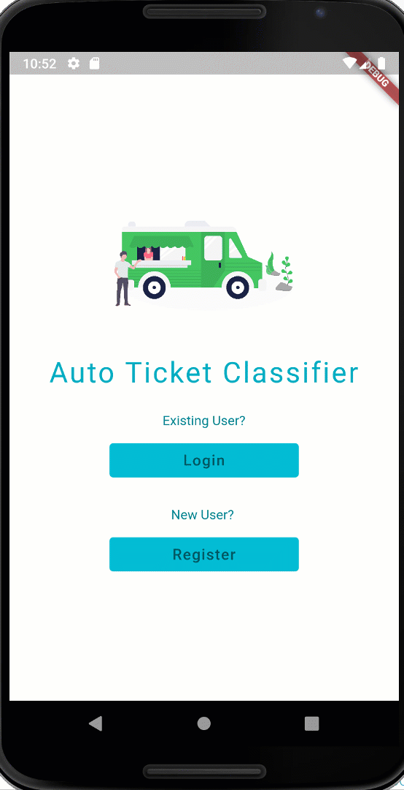

# Helpdesk Auto Ticket Classifier App using Flutter and DialogFlow

This is the Flutter Mobile App companion to the Helpdesk Auto Ticket Classifier Web App at https://github.com/rajesh1402/Helpdesk-Auto-Ticket-Classifier-App

The Web App is currently hosted on Google Cloud Platform at http://ticketclassifier.appspot.com/

Current release of the Flutter App supports
- Use of Flask REST API hosted on GCP for inference
- Integration with Stripe Android API to enable Card payments
- Integration with Dialog Helpdesk Agent to chat and submit ticket (Insert into common backend DB still pending)

Future releases will split the App into two - One for the End Customer (Ticket Submission workflow) and the Second for the Helpdesk Team Manager (for continuous training and configuring auto-classification and assignment of ticket to the right team.

## Screenshots

## Credits
Flutter-Dialogflow Integration:
https://ptyagicodecamp.github.io/implementing-flutter-factsbot-using-dialogflow.html

Flutter-Stripe Payment 
https://github.com/tristate-technology/Flutter-Stripe-Payment

Thanks to numerous other github repos and tutorials that I referred to get this working.

#### For more on Flutter:
A few resources to get you started:

- [Lab: Write your first Flutter app](https://flutter.dev/docs/get-started/codelab)
- [Cookbook: Useful Flutter samples](https://flutter.dev/docs/cookbook)
- [online documentation](https://flutter.dev/docs)
